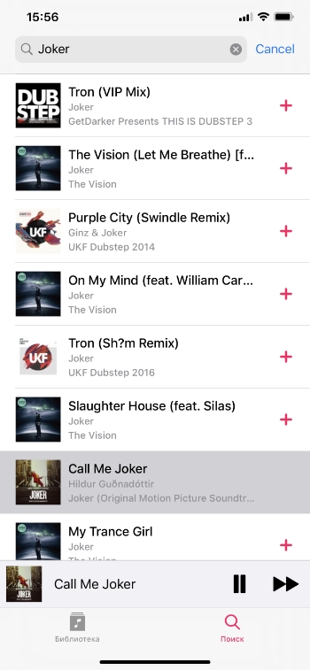
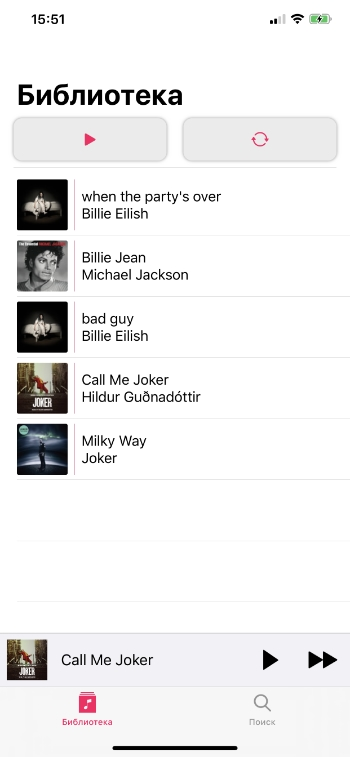

# Музыкальное приложение PureMusic

Мобильное приложение для поиска и прослушивания музыки с использованием iTunes Search API.

## Особенности приложения
 - архитектура Clean Swift;
 - использование UIKit & SwiftUI в связке для создания интерфейса;
 - плавная анимация при открытии трека на подобии официального приложения Apple Music;
 - возможность сохранить треки к себе в библиотеку;
 - работа с iTunes Search API.
## Функционал приложения
### Поиск треков
 Для поиска трека необходимо ввести название в соответствующую строку. 
  
 

После успешного запроса на экране будет представлен трек-лист, с которым пользователь может взаимодействовать. А именно:
  - по нажатию на кнопку "+" добавить трек в библиотеку;
  - по нажатию на интересующий трек запустить воспроизведение музыки.
  
При нажатии на определенный трек, открывается отдельное окно для управления воспроизведением трека.
  
 

В данном окне пользователь может переключать треки, регулировать их громкость, а также перематывать.
### Просмотр библиотеки треков
  
 

Данный экран реализован с использованием SwiftUI и представляет собой список треков пользователя. При нажатии на трек пользователь может прослушать выбранный трек. На экране также представлены две кнопки, которые позволяют:

- запустить весь плейлист с первого трека;
- обновить плейлист;

 Информация о треках хранится в UserDefaults.
 
 #### Баги
- При запуске плейлиста с первого трека на экране библиотеки, отсутствует возможность переключения треков. Проблема может заключаться в том, что не получается через keyWindow достучаться до нужного ViewController и изменить делегат.

